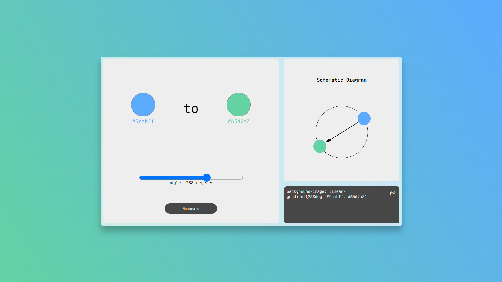

# CSS漸層生成器 CSS Gradient Generator

這是一個簡單的CSS漸層生成器網頁，使用者可以調整各種參數如顏色、角度方向來製作漸層。並透過生成及複製按鈕就可以複製其漸層樣式的CSS程式碼，套用到自己的項目裡面。\
This is a simple CSS gradient generator web page where users can adjust various parameters such as colors and angle direction to create gradients. Users can generate and copy the CSS code of their gradient styles to apply them in their own projects.

## 功能 Features

- 設置起始即結束顏色。Set starting and ending colors.
- 設置方向角度。Set direction angle.
- 複製CSS程式碼。Copy CSS code.

## 截圖 Screenshot
